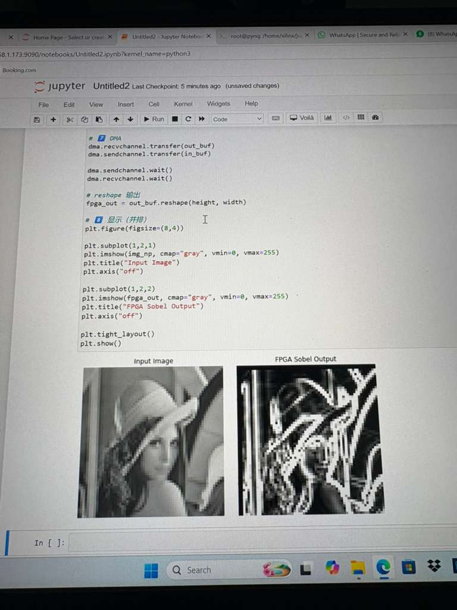
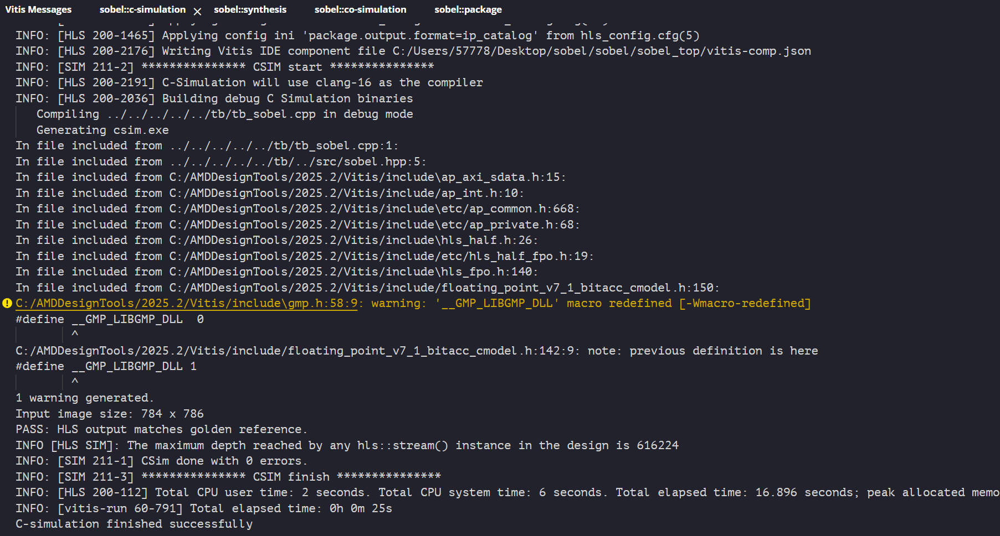
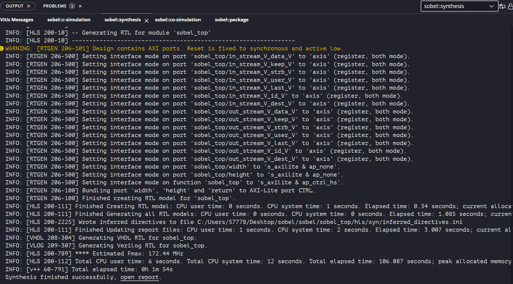
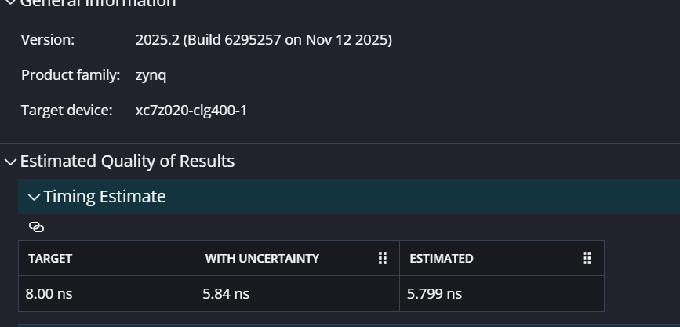
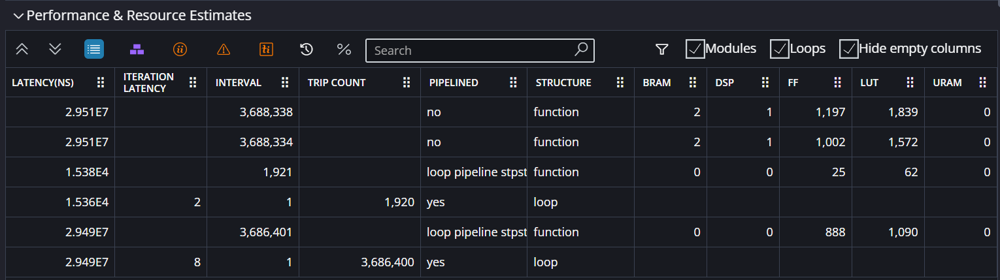

# Sobel Edge Detection Accelerator on FPGA (PYNQ-Z2)

## Overview

This project implements a **hardware-accelerated Sobel edge detection filter** using **Vitis HLS** and deploys it on a **PYNQ-Z2 FPGA board**. The accelerator follows a **fully streaming AXI-Stream + DMA architecture** to process grayscale images with high throughput and low on-chip memory usage.

The IP receives one grayscale pixel per AXI-Stream packet, maintains two line buffers and a 3×3 sliding window internally, computes Sobel gradients, clips the magnitude to 8 bits, and streams the result back to the processing system through AXI DMA.


## Demo

### FPGA Board (PYNQ-Z2)


### Input vs FPGA Output



---

## System Architecture

The system-level dataflow is:

```text
DDR (PS)
   ↓
AXI DMA (MM2S)
   ↓
AXI-Stream
   ↓
Sobel Accelerator (PL)
   ↓
AXI-Stream
   ↓
AXI DMA (S2MM)
   ↓
DDR (PS)
```

Inside the accelerator:

```text
Input Pixel Stream
      ↓
Line Buffer (2 previous rows)
      ↓
3×3 Sliding Window
      ↓
Sobel Compute (Gx, Gy)
      ↓
Magnitude Approximation (|Gx| + |Gy|)
      ↓
8-bit Clipping
      ↓
Output Pixel Stream
```

The accelerator does **not** buffer the full frame in PL. It only stores two image rows in line buffers and keeps the current 3×3 neighborhood in registers.

---

## IP Interface Definition

### Top-Level HLS Function

```cpp
void sobel_top(hls::stream<axis_t> &in_stream,
               hls::stream<axis_t> &out_stream,
               int width,
               int height);
```

### Interfaces

| Port | Interface | Direction | Purpose |
|---|---|---:|---|
| `in_stream` | AXI4-Stream | Input | Pixel stream from AXI DMA MM2S |
| `out_stream` | AXI4-Stream | Output | Edge-detected pixel stream to AXI DMA S2MM |
| `width` | AXI4-Lite | Input/control | Image width |
| `height` | AXI4-Lite | Input/control | Image height |
| `return` | AXI4-Lite | Control | HLS control/status register |

The top-level interface is implemented with:

```cpp
#pragma HLS INTERFACE axis port=in_stream
#pragma HLS INTERFACE axis port=out_stream
#pragma HLS INTERFACE s_axilite port=width  bundle=CTRL
#pragma HLS INTERFACE s_axilite port=height bundle=CTRL
#pragma HLS INTERFACE s_axilite port=return bundle=CTRL
```

### AXI-Stream Packet Format

The stream packet type is:

```cpp
typedef ap_axiu<8,1,1,1> axis_t;
```

Each packet carries one 8-bit grayscale pixel.

| Field | Role |
|---|---|
| `data` | 8-bit pixel value |
| `keep` / `strb` | Valid byte indicators |
| `user` | Asserted on the first output pixel of the frame |
| `last` | Asserted on the final output pixel of the frame |
| `id` / `dest` | Set to zero in this design |

---

## Sobel Operator Design

The Sobel operator computes horizontal and vertical gradients from a 3×3 pixel neighborhood:

```text
p00 p01 p02
p10 p11 p12
p20 p21 p22
```

The implemented equations are:

```text
Gx = (p02 + 2*p12 + p22) - (p00 + 2*p10 + p20)
Gy = (p20 + 2*p21 + p22) - (p00 + 2*p01 + p02)
```

The output magnitude is approximated as:

```text
Magnitude = |Gx| + |Gy|
Output    = clip(Magnitude, 0, 255)
```

This avoids the hardware cost of square, square root, and floating-point operations.

---

## Microarchitecture

### 1. Line Buffer + Sliding Window

The accelerator processes pixels in raster-scan order. For each input pixel, the design:

1. Reads the corresponding column value from two line buffers.
2. Shifts the 3×3 window left by one column.
3. Inserts the new rightmost column into the window.
4. Updates the line buffers for the next rows.

Conceptually:

```text
linebuf0[col] → window[0][2]
linebuf1[col] → window[1][2] → linebuf0[col]
input pixel   → window[2][2] → linebuf1[col]
```

The two line buffers store the previous two image rows, while the 3×3 window stores the active convolution neighborhood.

### 2. Border Behavior

At the beginning of the stream, a full 3×3 neighborhood is not yet available. The design initializes `out_pix = 0` and only computes Sobel when:

```cpp
if (row >= 2 && col >= 2)
```

Therefore, the first two rows and first two columns are output as zero-valued border pixels. The output stream still has exactly `width × height` packets.

### 3. Module Partitioning

| File | Purpose |
|---|---|
| `src/sobel_top.cpp` | Top-level HLS wrapper and AXI interface pragmas |
| `src/sobel_core.cpp` | Main streaming Sobel pipeline |
| `src/window_generator.cpp` | Line-buffer update and 3×3 window generation |
| `src/sobel_ref.cpp` | Software golden reference model |
| `tb/tb_sobel.cpp` | C simulation testbench |
| `src/sobel.hpp` | Shared constants, types, and function prototypes |

---

## HLS Optimizations

### 1. Pixel Pipeline with II = 1

The inner column loop is pipelined:

```cpp
#pragma HLS PIPELINE II=1
```

The column loop is the correct loop to pipeline because each iteration processes one pixel. After the pipeline is filled, the accelerator can accept one input pixel and produce one output pixel per cycle.

### 2. Complete Partitioning of the 3×3 Window

```cpp
#pragma HLS ARRAY_PARTITION variable=window complete dim=0
```

The 3×3 window is small and accessed many times in parallel during Sobel computation. Complete partitioning maps the nine window elements to registers, allowing all pixels in the 3×3 neighborhood to be read in the same cycle without memory port conflicts.

### 3. Dual-Port BRAM Line Buffers

```cpp
#pragma HLS BIND_STORAGE variable=linebuf0 type=ram_2p impl=bram
#pragma HLS BIND_STORAGE variable=linebuf1 type=ram_2p impl=bram
```

The line buffers are larger arrays indexed by image column. Binding them to dual-port BRAM supports simultaneous read/write access patterns during streaming window updates while keeping register usage low.

### 4. Bitwidth Optimization

The Sobel computation uses fixed-width integer types:

```cpp
ap_int<12> gx, gy;
ap_uint<12> mag;
```

The maximum Sobel magnitude for 8-bit pixels fits within 12 bits. This reduces LUT usage and shortens the combinational path compared with default 32-bit integer arithmetic.

### 5. Shift-Based Multiply-by-2

The Sobel coefficients of 2 are implemented with shifts:

```cpp
(p10 << 1)
(p12 << 1)
(p01 << 1)
(p21 << 1)
```

This avoids unnecessary multiplier hardware.

### 6. AXI-Stream Framing

The output stream preserves frame boundaries:

```cpp
out_pkt.user = (idx == 0) ? 1 : 0;
out_pkt.last = ((row == height - 1) && (col == width - 1)) ? 1 : 0;
```

`user` marks the first output packet and `last` marks the final packet, making the IP compatible with DMA-based image transfer.

---

## Functional Verification

The design was verified using **Vitis HLS 2025.2 C simulation**. The testbench streams a grayscale input image into the HLS DUT, computes a software golden reference using `sobel_ref()`, and compares every output pixel against the expected Sobel result.

### C Simulation Result

| Item | Result |
|---|---|
| Tool | Vitis HLS 2025.2 |
| Target Device | `xc7z020clg400-1` |
| Clock Target | 125 MHz / 8 ns |
| Input Image Size | 784 × 786 |
| Golden Reference Check | PASS |
| CSim Errors | 0 |

Relevant C simulation output:

```text
Input image size: 784 x 786
PASS: HLS output matches golden reference.
INFO: [SIM 211-1] CSim done with 0 errors.
```

This confirms that the streaming HLS implementation matches the software Sobel reference for the tested image.



### Functional Test Coverage

| Test Case       | Image Size | Input Pattern             | Expected Behavior                       | Result |
| --------------- | ---------: | ------------------------- | --------------------------------------- | ------ |
| Main image test |  784 × 786 | Real grayscale image      | Matches software `sobel_ref()`          | PASS   |
| Small image     |      8 × 8 | Simple gradient           | Matches software `sobel_ref()`          | PASS   |
| All-zero image  |    64 × 64 | All pixels = 0            | Output all zeros                        | PASS   |
| Constant image  |    64 × 64 | All pixels = 128          | Output all zeros except border behavior | PASS   |
| Edge pattern    |    64 × 64 | Vertical black/white edge | Strong edge response near boundary      | PASS   |

---

## HLS Synthesis Results

The design was synthesized using **Vitis HLS 2025.2** targeting the PYNQ-Z2 device `xc7z020-clg400-1`.

### Timing Estimate

| Metric | Value |
|---|---:|
| Target Clock Period | 8.00 ns |
| Target Frequency | 125 MHz |
| Estimated Clock Period | 5.799 ns |
| Estimated Frequency | ~172 MHz |
| Clock Uncertainty | 2.16 ns |

The estimated HLS clock period is below the 8 ns target, so the design meets the requested 125 MHz HLS timing target.



### Latency Estimate

| Metric | Value |
|---|---:|
| Top-Level Minimum Latency | 4 cycles |
| Top-Level Maximum Latency | 3,688,337 cycles |
| Top-Level Maximum Latency | 29.507 ms |
| `sobel_core` Maximum Latency | 3,688,334 cycles |

The top-level latency includes control overhead, line-buffer initialization, and full-frame streaming. The main pixel-processing loop is pipelined with `II=1`, so the steady-state throughput is one pixel per cycle after pipeline fill.



### Resource Utilization Estimate

| Resource | Used | Available | Utilization |
|---|---:|---:|---:|
| BRAM_18K | 2 | 280 | ~0% |
| DSP | 1 | 220 | ~0% |
| FF | 1,197 | 106,400 | 1% |
| LUT | 1,837 | 53,200 | 3% |
| URAM | 0 | 0 | 0% |

The design uses only two BRAM blocks for the line buffers and a small amount of LUT/FF logic for stream control, window registers, and Sobel arithmetic. This leaves substantial FPGA resources available for future extensions such as multi-pixel-per-cycle processing or video-pipeline integration.



## Post-Implementation Results

After Vivado place-and-route on the full system (PS + AXI DMA + Sobel IP), the
implemented design was verified against two committed reports:
`reports/design_1_sobel_top_0_0_utilization_synth.rpt` and
`reports/design_1_wrapper_timing_summary_routed.rpt`.

### Timing: HLS Estimate vs Post-Implementation

| Metric                     |   HLS Estimate | Post-Implementation |
| -------------------------- | -------------: | ------------------: |
| Clock period target        |        8.00 ns |   20.00 ns (50 MHz) |
| Worst Negative Slack (WNS) | +2.20 ns (met) |    +10.114 ns (met) |
| Worst Hold Slack (WHS)     |              — |     +0.028 ns (met) |
| Failing endpoints          |              0 |                   0 |

The system-level clock runs at **50 MHz** (20 ns period) on the PYNQ-Z2, which
is the PS-derived `clk_fpga_0`. This is more conservative than the 125 MHz HLS
target because the full Block Design includes the PS7, AXI DMA, and
interconnect, and Vivado selects the default PS clock for system integration.
The WNS of **+10.114 ns** means the critical path only takes 9.886 ns out of
the 20 ns budget — a comfortable 50% timing margin. All 11,281 setup endpoints
and all hold endpoints pass with zero violations, confirming the routed design
is fully timing-clean.

### Resource: HLS Estimate vs Post-Implementation (Sobel IP only)

| Resource | HLS Estimate | Post-Impl (Sobel IP) | Available | Post-Impl % |
| -------- | -----------: | -------------------: | --------: | ----------: |
| LUT      |        1,837 |                  595 |    53,200 |       1.12% |
| FF       |        1,197 |                  713 |   106,400 |       0.67% |
| BRAM_18K |            2 |                    2 |       280 |       0.71% |
| DSP      |            1 |                    1 |       220 |       0.45% |

The post-implementation LUT count (595) is significantly lower than the HLS
estimate (1,837) because Vivado's physical optimization and LUT combining passes
eliminate redundant logic that HLS conservatively reports. FF count also drops
from 1,197 to 713 for the same reason. BRAM and DSP counts match exactly — both
are hard resources that are not affected by logic optimization. The two RAMB18E1
primitives correspond directly to `linebuf0` and `linebuf1`, confirming the
`BIND_STORAGE` pragma was honored. The single DSP48E1 corresponds to the
accumulator in the Sobel magnitude path.

Overall the Sobel IP consumes under 2% of any resource category on the
xc7z020, leaving ample headroom for future extensions such as multi-channel
processing or Canny edge detection.

---

## Performance Summary

| Metric | Value |
|---|---:|
| Pipeline II | 1 |
| Steady-State Throughput | 1 pixel / cycle |
| Target Frequency | 125 MHz |
| Estimated HLS Frequency | ~172 MHz |
| Input Test Image | 784 × 786 |
| Resource Footprint | 2 BRAM, 1 DSP, 1,837 LUT, 1,197 FF |
| Architecture | Fully streaming line-buffer design |

At the 125 MHz target clock, an II=1 design corresponds to a theoretical steady-state throughput of approximately **125 million pixels per second**.

---

## Reproducing the HLS Results

The project can be rebuilt using **Vitis HLS 2025.2**.

### Quick Start (Makefile)

```bash
make csim    # Run C simulation
make synth   # Run C synthesis
make cosim   # Run RTL co-simulation
make all     # Run csim + synth
```

### Source Files

```text
src/sobel.hpp
src/sobel_top.cpp
src/sobel_core.cpp
src/window_generator.cpp
src/sobel_ref.cpp
tb/tb_sobel.cpp
sobel/hls_config.cfg
```

### Run C Simulation

```bash
vitis-run --mode hls --config sobel/hls_config.cfg --csim
```

Expected result:

```text
PASS: HLS output matches golden reference.
CSim done with 0 errors.
```

### Run C Synthesis

```bash
vitis-run --mode hls --config sobel/hls_config.cfg --synth
```

The generated synthesis report should include timing, latency, and utilization estimates similar to the tables above.

## Committed Verification Reports

The following report files are committed in this repository and can be inspected directly:

Full C simulation log: [`reports/hls_run_csim.log`](./reports/hls_run_csim.log)

HLS C simulation log: `reports/sobel_top_csim.log`

Full HLS synthesis report: [`reports/sobel_top_csynth.rpt`](./reports/sobel_top_csynth.rpt)

The synthesis report provides the timing estimate, latency estimate, initiation interval, and resource utilization numbers used in the tables below.

================================================================

### hls_run_csim.log

  **** HLS Build v2025.2 6295257
INFO: [HLS 200-2005] Using work_dir C:/Users/57778/Desktop/sobel/sobel/sobel_top 
INFO: [HLS 200-2176] Writing Vitis IDE component file C:/Users/57778/Desktop/sobel/sobel/sobel_top/vitis-comp.json
INFO: [HLS 200-10] Creating and opening component 'C:/Users/57778/Desktop/sobel/sobel/sobel_top'.
INFO: [HLS 200-1505] Using default flow_target 'vivado'
Resolution: For help on HLS 200-1505 see docs.amd.com/access/sources/dita/topic?Doc_Version=2025.2%20English&url=ug1448-hls-guidance&resourceid=200-1505.html
INFO: [HLS 200-2174] Applying component config ini file hls_config.cfg
INFO: [HLS 200-1465] Applying config ini 'syn.file=../src/sobel.hpp' from hls_config.cfg(10)
INFO: [HLS 200-10] Adding design file 'C:/Users/57778/Desktop/sobel/src/sobel.hpp' to the project
INFO: [HLS 200-1465] Applying config ini 'syn.file=../src/sobel_core.cpp' from hls_config.cfg(11)
INFO: [HLS 200-10] Adding design file 'C:/Users/57778/Desktop/sobel/src/sobel_core.cpp' to the project
INFO: [HLS 200-1465] Applying config ini 'syn.file=../src/sobel_top.cpp' from hls_config.cfg(12)
INFO: [HLS 200-10] Adding design file 'C:/Users/57778/Desktop/sobel/src/sobel_top.cpp' to the project
INFO: [HLS 200-1465] Applying config ini 'syn.file=../src/window_generator.cpp' from hls_config.cfg(13)
INFO: [HLS 200-10] Adding design file 'C:/Users/57778/Desktop/sobel/src/window_generator.cpp' to the project
INFO: [HLS 200-1465] Applying config ini 'syn.file=../src/sobel_ref.cpp' from hls_config.cfg(14)
INFO: [HLS 200-10] Adding design file 'C:/Users/57778/Desktop/sobel/src/sobel_ref.cpp' to the project
INFO: [HLS 200-1465] Applying config ini 'tb.file=../tb/tb_sobel.cpp' from hls_config.cfg(8)
INFO: [HLS 200-10] Adding test bench file 'C:/Users/57778/Desktop/sobel/tb/tb_sobel.cpp' to the project
INFO: [HLS 200-1465] Applying config ini 'syn.top=sobel_top' from hls_config.cfg(7)
INFO: [HLS 200-1465] Applying config ini 'flow_target=vivado' from hls_config.cfg(4)
INFO: [HLS 200-1505] Using flow_target 'vivado'
Resolution: For help on HLS 200-1505 see docs.amd.com/access/sources/dita/topic?Doc_Version=2025.2%20English&url=ug1448-hls-guidance&resourceid=200-1505.html
INFO: [HLS 200-1465] Applying config ini 'part=xc7z020clg400-1' from hls_config.cfg(1)
INFO: [HLS 200-1611] Setting target device to 'xc7z020-clg400-1'
INFO: [HLS 200-1465] Applying config ini 'clock=125Mhz' from hls_config.cfg(9)
INFO: [SYN 201-201] Setting up clock 'default' with a period of 8ns.
INFO: [HLS 200-1465] Applying config ini 'cosim.trace_level=port' from hls_config.cfg(15)
INFO: [HLS 200-1465] Applying config ini 'cosim.wave_debug=1' from hls_config.cfg(16)
INFO: [HLS 200-1465] Applying config ini 'package.output.format=ip_catalog' from hls_config.cfg(5)
INFO: [HLS 200-2176] Writing Vitis IDE component file C:/Users/57778/Desktop/sobel/sobel/sobel_top/vitis-comp.json
INFO: [SIM 211-2] *************** CSIM start ***************
INFO: [HLS 200-2191] C-Simulation will use clang-16 as the compiler
INFO: [HLS 200-2036] Building debug C Simulation binaries
   Generating csim.exe
Input image size: 784 x 786
PASS: HLS output matches golden reference.
INFO [HLS SIM]: The maximum depth reached by any hls::stream() instance in the design is 616224
INFO: [SIM 211-1] CSim done with 0 errors.
INFO: [SIM 211-3] *************** CSIM finish ***************
INFO: [HLS 200-112] Total CPU user time: 2 seconds. Total CPU system time: 5 seconds. Total elapsed time: 13.387 seconds; peak allocated memory: 151.902 MB.

### **sobel_top_csynth.rpt**

#### == Vitis HLS Report for 'sobel_top'
* Date:           Sat Apr 25 21:03:30 2026

* Version:        2025.2 (Build 6295257 on Nov 12 2025)
* Project:        sobel_top
* Solution:       hls (Vivado IP Flow Target)
* Product family: zynq
* Target device:  xc7z020-clg400-1


================================================================
#### == Performance Estimates
+ Timing: 
    * Summary: 
    +--------+---------+----------+------------+
    |  Clock |  Target | Estimated| Uncertainty|
    +--------+---------+----------+------------+
    |ap_clk  |  8.00 ns|  5.799 ns|     2.16 ns|
    +--------+---------+----------+------------+

+ Latency: 
    * Summary: 
    +---------+---------+-----------+-----------+-----+---------+---------+
    |  Latency (cycles) |   Latency (absolute)  |    Interval   | Pipeline|
    |   min   |   max   |    min    |    max    | min |   max   |   Type  |
    +---------+---------+-----------+-----------+-----+---------+---------+
    |        4|  3688337|  32.000 ns|  29.507 ms|    5|  3688338|       no|
    +---------+---------+-----------+-----------+-----+---------+---------+

    + Detail: 
        * Instance: 
        +----------------------+------------+---------+---------+----------+-----------+-----+---------+---------+
        |                      |            |  Latency (cycles) |  Latency (absolute)  |    Interval   | Pipeline|
        |       Instance       |   Module   |   min   |   max   |    min   |    max    | min |   max   |   Type  |
        +----------------------+------------+---------+---------+----------+-----------+-----+---------+---------+
        |grp_sobel_core_fu_84  |sobel_core  |        1|  3688334|  8.000 ns|  29.507 ms|    1|  3688334|       no|
        +----------------------+------------+---------+---------+----------+-----------+-----+---------+---------+

        * Loop: 
        N/A


================================================================
#### == Utilization Estimates
* Summary: 
+-----------------+---------+-----+--------+-------+-----+
|       Name      | BRAM_18K| DSP |   FF   |  LUT  | URAM|
+-----------------+---------+-----+--------+-------+-----+
|DSP              |        -|    -|       -|      -|    -|
|Expression       |        -|    -|       0|      2|    -|
|FIFO             |        -|    -|       -|      -|    -|
|Instance         |        2|    1|    1114|   1738|    -|
|Memory           |        -|    -|       -|      -|    -|
|Multiplexer      |        -|    -|       0|     97|    -|
|Register         |        -|    -|      83|      -|    -|
+-----------------+---------+-----+--------+-------+-----+
|Total            |        2|    1|    1197|   1837|    0|
+-----------------+---------+-----+--------+-------+-----+
|Available        |      280|  220|  106400|  53200|    0|
+-----------------+---------+-----+--------+-------+-----+
|Utilization (%)  |       ~0|   ~0|       1|      3|    0|
+-----------------+---------+-----+--------+-------+-----+

+ Detail: 
    * Instance: 
    +----------------------+------------+---------+----+------+------+-----+
    |       Instance       |   Module   | BRAM_18K| DSP|  FF  |  LUT | URAM|
    +----------------------+------------+---------+----+------+------+-----+
    |CTRL_s_axi_U          |CTRL_s_axi  |        0|   0|   112|   168|    0|
    |grp_sobel_core_fu_84  |sobel_core  |        2|   1|  1002|  1570|    0|
    +----------------------+------------+---------+----+------+------+-----+
    |Total                 |            |        2|   1|  1114|  1738|    0|
    +----------------------+------------+---------+----+------+------+-----+

    * DSP: 
    N/A

    * Memory: 
    N/A

    * FIFO: 
    N/A

    * Expression: 
    +----------------------------------------+----------+----+---+----+------------+------------+
    |              Variable Name             | Operation| DSP| FF| LUT| Bitwidth P0| Bitwidth P1|
    +----------------------------------------+----------+----+---+----+------------+------------+
    |grp_sobel_core_fu_84_out_stream_TREADY  |       and|   0|  0|   2|           1|           1|
    +----------------------------------------+----------+----+---+----+------------+------------+
    |Total                                   |          |   0|  0|   2|           1|           1|
    +----------------------------------------+----------+----+---+----+------------+------------+

    * Multiplexer: 
    +-------------------------------+----+-----------+-----+-----------+
    |              Name             | LUT| Input Size| Bits| Total Bits|
    +-------------------------------+----+-----------+-----+-----------+
    |ap_NS_fsm                      |  25|          5|    1|          5|
    |in_stream_TREADY_int_regslice  |   9|          2|    1|          2|
    |out_stream_TDATA_int_regslice  |   9|          2|    8|         16|
    |out_stream_TDEST_int_regslice  |   9|          2|    1|          2|
    |out_stream_TID_int_regslice    |   9|          2|    1|          2|
    |out_stream_TKEEP_int_regslice  |   9|          2|    1|          2|
    |out_stream_TLAST_int_regslice  |   9|          2|    1|          2|
    |out_stream_TSTRB_int_regslice  |   9|          2|    1|          2|
    |out_stream_TUSER_int_regslice  |   9|          2|    1|          2|
    +-------------------------------+----+-----------+-----+-----------+
    |Total                          |  97|         21|   16|         35|
    +-------------------------------+----+-----------+-----+-----------+

    * Register: 
    +-----------------------------------+----+----+-----+-----------+
    |                Name               | FF | LUT| Bits| Const Bits|
    +-----------------------------------+----+----+-----+-----------+
    |ap_CS_fsm                          |   4|   0|    4|          0|
    |grp_sobel_core_fu_84_ap_start_reg  |   1|   0|    1|          0|
    |height_read_reg_120                |  32|   0|   32|          0|
    |out_stream_TDATA_reg               |   8|   0|    8|          0|
    |out_stream_TDEST_reg               |   1|   0|    1|          0|
    |out_stream_TID_reg                 |   1|   0|    1|          0|
    |out_stream_TKEEP_reg               |   1|   0|    1|          0|
    |out_stream_TLAST_reg               |   1|   0|    1|          0|
    |out_stream_TSTRB_reg               |   1|   0|    1|          0|
    |out_stream_TUSER_reg               |   1|   0|    1|          0|
    |width_read_reg_125                 |  32|   0|   32|          0|
    +-----------------------------------+----+----+-----+-----------+
    |Total                              |  83|   0|   83|          0|
    +-----------------------------------+----+----+-----+-----------+


================================================================
#### == Interface
* Summary: 
+--------------------+-----+-----+------------+---------------------+--------------+
|      RTL Ports     | Dir | Bits|  Protocol  |    Source Object    |    C Type    |
+--------------------+-----+-----+------------+---------------------+--------------+
|s_axi_CTRL_AWVALID  |   in|    1|       s_axi|                 CTRL|        scalar|
|s_axi_CTRL_AWREADY  |  out|    1|       s_axi|                 CTRL|        scalar|
|s_axi_CTRL_AWADDR   |   in|    5|       s_axi|                 CTRL|        scalar|
|s_axi_CTRL_WVALID   |   in|    1|       s_axi|                 CTRL|        scalar|
|s_axi_CTRL_WREADY   |  out|    1|       s_axi|                 CTRL|        scalar|
|s_axi_CTRL_WDATA    |   in|   32|       s_axi|                 CTRL|        scalar|
|s_axi_CTRL_WSTRB    |   in|    4|       s_axi|                 CTRL|        scalar|
|s_axi_CTRL_ARVALID  |   in|    1|       s_axi|                 CTRL|        scalar|
|s_axi_CTRL_ARREADY  |  out|    1|       s_axi|                 CTRL|        scalar|
|s_axi_CTRL_ARADDR   |   in|    5|       s_axi|                 CTRL|        scalar|
|s_axi_CTRL_RVALID   |  out|    1|       s_axi|                 CTRL|        scalar|
|s_axi_CTRL_RREADY   |   in|    1|       s_axi|                 CTRL|        scalar|
|s_axi_CTRL_RDATA    |  out|   32|       s_axi|                 CTRL|        scalar|
|s_axi_CTRL_RRESP    |  out|    2|       s_axi|                 CTRL|        scalar|
|s_axi_CTRL_BVALID   |  out|    1|       s_axi|                 CTRL|        scalar|
|s_axi_CTRL_BREADY   |   in|    1|       s_axi|                 CTRL|        scalar|
|s_axi_CTRL_BRESP    |  out|    2|       s_axi|                 CTRL|        scalar|
|ap_clk              |   in|    1|  ap_ctrl_hs|            sobel_top|  return value|
|ap_rst_n            |   in|    1|  ap_ctrl_hs|            sobel_top|  return value|
|interrupt           |  out|    1|  ap_ctrl_hs|            sobel_top|  return value|
|in_stream_TDATA     |   in|    8|        axis|   in_stream_V_data_V|       pointer|
|in_stream_TVALID    |   in|    1|        axis|   in_stream_V_dest_V|       pointer|
|in_stream_TREADY    |  out|    1|        axis|   in_stream_V_dest_V|       pointer|
|in_stream_TDEST     |   in|    1|        axis|   in_stream_V_dest_V|       pointer|
|in_stream_TKEEP     |   in|    1|        axis|   in_stream_V_keep_V|       pointer|
|in_stream_TSTRB     |   in|    1|        axis|   in_stream_V_strb_V|       pointer|
|in_stream_TUSER     |   in|    1|        axis|   in_stream_V_user_V|       pointer|
|in_stream_TLAST     |   in|    1|        axis|   in_stream_V_last_V|       pointer|
|in_stream_TID       |   in|    1|        axis|     in_stream_V_id_V|       pointer|
|out_stream_TDATA    |  out|    8|        axis|  out_stream_V_data_V|       pointer|
|out_stream_TVALID   |  out|    1|        axis|  out_stream_V_dest_V|       pointer|
|out_stream_TREADY   |   in|    1|        axis|  out_stream_V_dest_V|       pointer|
|out_stream_TDEST    |  out|    1|        axis|  out_stream_V_dest_V|       pointer|
|out_stream_TKEEP    |  out|    1|        axis|  out_stream_V_keep_V|       pointer|
|out_stream_TSTRB    |  out|    1|        axis|  out_stream_V_strb_V|       pointer|
|out_stream_TUSER    |  out|    1|        axis|  out_stream_V_user_V|       pointer|
|out_stream_TLAST    |  out|    1|        axis|  out_stream_V_last_V|       pointer|
|out_stream_TID      |  out|    1|        axis|    out_stream_V_id_V|       pointer|
+--------------------+-----+-----+------------+---------------------+--------------+

---

## Software Deployment on PYNQ

Python/Jupyter on PYNQ is used to:

1. Load the generated overlay.
2. Allocate input/output buffers in DDR.
3. Send the input image through AXI DMA.
4. Receive the output image through AXI DMA.
5. Display or save the edge-detected result.

Example transfer pattern:

```python
dma.recvchannel.transfer(out_buf)
dma.sendchannel.transfer(in_buf)

dma.sendchannel.wait()
dma.recvchannel.wait()
```

---

## Project Structure

```text
src/
    sobel_top.cpp
    sobel_core.cpp
    window_generator.cpp
    sobel.hpp
    sobel_ref.cpp

tb/
    tb_sobel.cpp

reports/
    hls_run_csim.log
    sobel_top_csynth.rpt

images/
    show.png
    fpga.png

sobel/
    hls_config.cfg
```

---

## Repository Cleanliness

Generated Vitis/Vivado files should not be committed unless they are intentionally included as evidence. Suggested files to remove or ignore include:

```text
_ide/
.vscode/
.cache/
compile_commands.json
sobel_pynz2.cache/
*.jou
*.log outside reports/
```

A recommended `.gitignore` is:

```gitignore
# Vitis / Vivado generated files
.vitis/
.vivado/
.ide/
_ide/
.cache/
*.cache/
*.runs/
*.gen/
*.hw/
*.ip_user_files/
*.jou
*.str

# Keep intentional evidence under reports/
*.log
!reports/*.log
!reports/*.rpt

# VSCode / clangd
.vscode/
compile_commands.json
.cache/clangd/

# Build outputs
*.o
*.exe
csim/
cosim/
solution*/
```

---

## Key Takeaways

- Streaming design is essential for FPGA image-processing throughput.
- Two line buffers are sufficient for 3×3 Sobel convolution, avoiding full-frame buffering in PL.
- Complete partitioning of the 3×3 window enables parallel pixel access.
- Dual-port BRAM is a good fit for line buffers because each pixel update requires read/write behavior.
- Pipelining the inner pixel loop with `II=1` is more important than only increasing clock frequency.
- AXI-Stream framing with `user` and `last` makes the IP compatible with DMA-based image transfer.

---

## Future Work

- Multi-pixel-per-cycle AXI stream, such as 32-bit or 64-bit packed pixels.
- Vectorized Sobel computation.
- Real-time camera input integration.
- Full video pipeline with HDMI input/output.
- Additional filters such as Gaussian blur, thresholding, or Canny edge detection.

---

## Author

Lixuan Xu  
NYU Tandon School of Engineering
